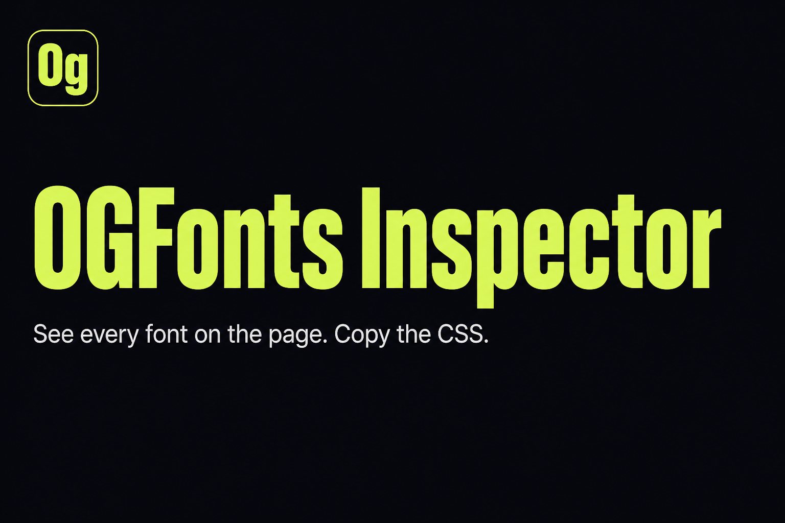
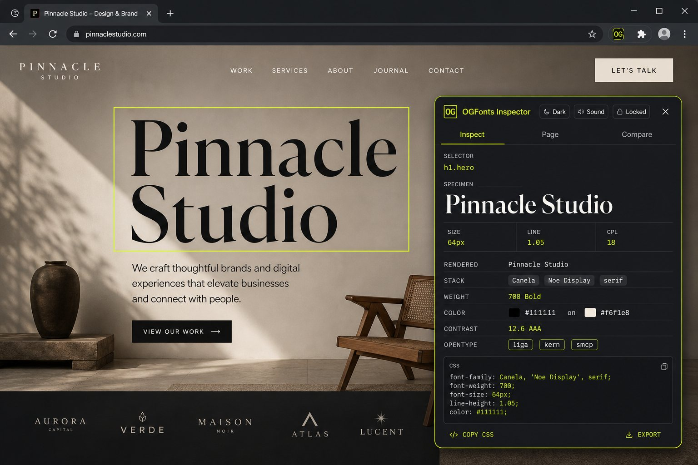
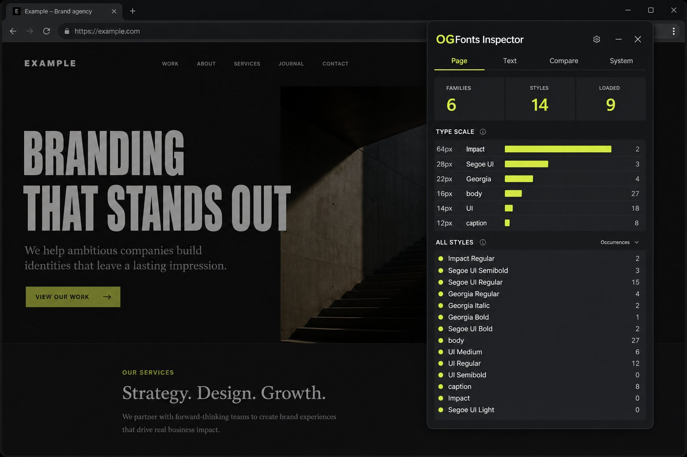
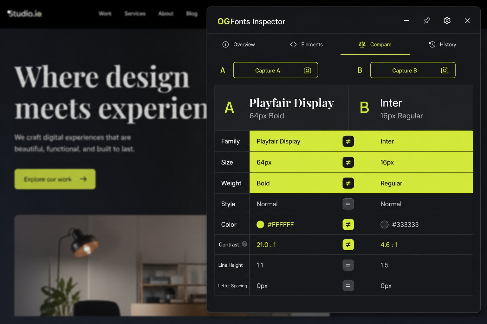

<p align="center">
  
</p>

<h1 align="center">OGFonts Inspector</h1>

<p align="center">
  <strong>See every font on the page. Lock it. Copy the CSS.</strong><br>
  A fast, offline Chrome inspector for type — built for designers who are tired of guessing.
</p>

<p align="center">
  
  
  
  
</p>

<p align="center">
  
</p>

---

## Why it exists

Most font tools show you **one** element. That is not how type systems work.

OGFonts Inspector is a panel you open on any site. Hover to preview, click to lock, then audit the whole page: families, sizes, weights, contrast, OpenType, and export-ready CSS / tokens / Tailwind.

No account. No tracking. No “cloud lookup.” It runs in the page you already opened.

---

## Screenshots

### Inspect — hover, lock, copy

<p align="center">
  
</p>

Hover any text for a live readout. Click to lock. Hover something else to peek, then it snaps back to the lock.

### Page — type audit

<p align="center">
  
</p>

One scan of the page: every family, every size on the scale, occurrence counts, loaded `@font-face` entries. Click a row to jump back to Inspect and highlight matches.

### Compare — A vs B

<p align="center">
  
</p>

Capture two elements. Diff family, size, weight, tracking, color, and contrast.

---

## Features

| | |
| --- | --- |
| **Live inspect** | Rendered family (not just the CSS stack), weight, size, line-height, tracking, color |
| **Click to lock** | Hover still peeks after lock. Esc unlocks, then closes |
| **Page audit** | Families, type scale, every unique style, loaded faces |
| **Highlight matches** | Paint every element using the same family / size / weight |
| **Contrast** | WCAG AA / AAA, including colors the browser gives as `oklch` |
| **OpenType playground** | Toggle `liga`, `kern`, `smcp`, `tnum`, `zero`, `onum`, `ss01`, `ss02` |
| **Export** | CSS, design tokens, Tailwind, JSON — click any row to copy |
| **Compare** | Pin A and B, see the diff |
| **Themes** | Dark and light. Sound on / mute. Panel position and size remembered |
| **Private** | `activeTab` only. Nothing is uploaded. Works after you go offline |

---

## Install (unpacked)

Chrome Web Store listing is coming. Until then, load it in 60 seconds:

1. Download this repository (Code → **Download ZIP**, or clone it).
2. Unzip it. The folder you want is the one that contains `manifest.json`.
3. Open Chrome → `chrome://extensions`
4. Turn on **Developer mode** (top right).
5. Click **Load unpacked** and select that folder.
6. Pin **OGFonts Inspector** to the toolbar.

Shortcut: **Alt+Shift+F**

Try it on `demo.html` in this repo first, then on any `http` / `https` page.

> After you click **Reload** on `chrome://extensions`, refresh the webpage once. Chrome cannot revive a content script that belonged to the previous version.

---

## How to use

1. Open a page. Click the **Og** icon (or press **Alt+Shift+F**).
2. **Hover** text — the lime box follows, the panel updates.
3. **Click** to lock that element. The panel border goes lime.
4. Hover other type to **peek**. Move away, and the locked type returns.
5. Copy CSS from the export block, or click any value row.
6. Open **Page** for a full type audit. **Highlight** paints every match.
7. Open **Compare**, capture A and B, read the diff.
8. Esc once to unlock. Esc again to close.

### Keyboard

| Key | Action |
| --- | --- |
| `Alt+Shift+F` | Toggle the inspector |
| `Esc` | Unlock, then close |
| `P` | Lock / unlock |
| `H` | Highlight matches |
| `C` | Copy current export |
| `[` / `]` | Walk to parent / child |
| `1` `2` `3` | Inspect / Page / Compare |

---

## Privacy

OGFonts Inspector is built to stay on your machine.

- Permissions: `activeTab`, `scripting`, `storage`
- Injected only when you click the icon or use the shortcut — not on every page load
- No analytics, no accounts, no remote font database
- Panel CSS and Fira Code are bundled
- Sounds are synthesized locally with the Web Audio API ([Cuelume](https://github.com/bytonuzzz/cuelume))

The only network Chrome itself may use is the usual extension update check, if you later install from the Web Store.

---

## Project layout

```
manifest.json      Chrome MV3 manifest
background.js      Toolbar click, inject, badge
content.js         Inspector (shadow DOM, offline)
panel.css          Panel, themes, overlay
vendor/cuelume.js  Local UI sounds
fonts/             Fira Code (SIL OFL)
icons/             Og mark
demo.html          Local type samples
```

Load **this folder** in `chrome://extensions`. Do not load a parent directory that contains other extensions.

---

## Credits

- UI type in the panel: [Fira Code](https://github.com/tonsky/FiraCode) (SIL Open Font License)
- UI sounds: [Cuelume](https://github.com/bytonuzzz/cuelume) (MIT)

---

## License

[MIT](LICENSE) © OGFonts

Issues and pull requests are welcome on this repository: [github.com/OGFonts/inspector](https://github.com/OGFonts/inspector)
